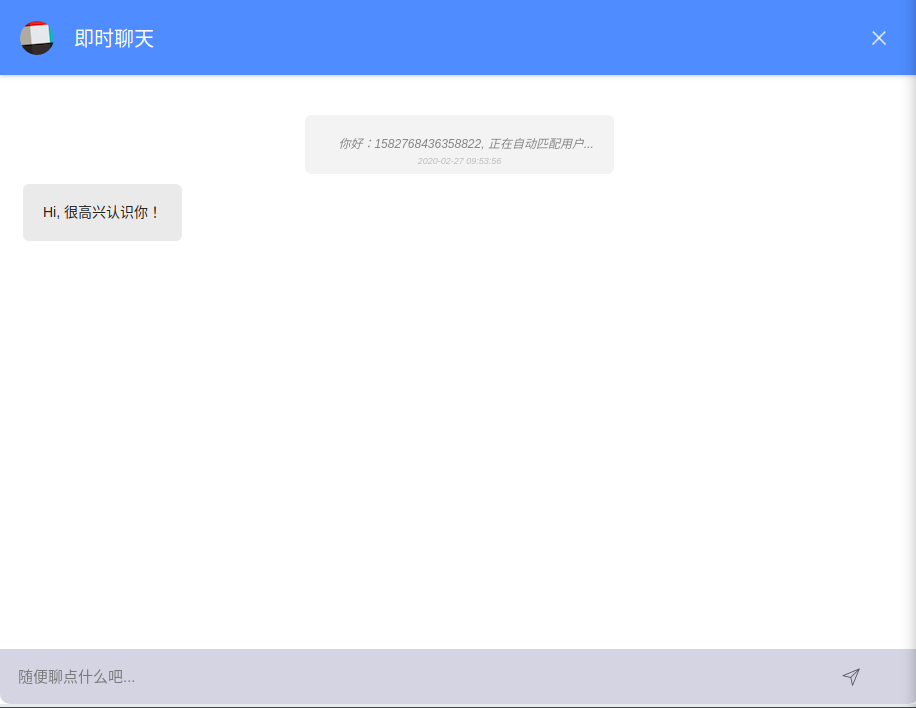

# 基于 golang 实现的匿名聊天

> 基于 goim 实现的后端通信，主要分为 comet、logic、job 三大模块均可独立部署、分布式部署

> 通过 comet 实现维持客户端长连接、通过 logic 以 http 的方式发送，job 消费消息队列将消息发送 comet

> 三大模块之间通过 grpc 通信

## 后端技术栈

- golang
- goim
- kafka
- discovery 服务发现
- gin
- redis

## 前端技术栈

- vue
- websocket

## 如何运行

> 运行 golang 后端

```
cd ./chat-golang-backend/
docker-compose up -d
```

> 运行前端 UI

```
cd ./chat-golang-frontend/
yarn install
npm run dev
```

## 效果图



## 其他注意事项

> 跨域问题

> 3111 端口是 http 方式通信,需要解决跨域问题，可以通过后端 nginx 反代 添加 header 头实现
